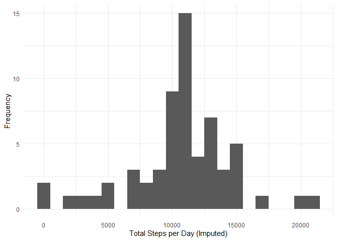

## Load the data


```r
unzip("activity.zip")
activity_data <- read.csv("activity.csv")
```

## Calculate the total number of steps taken per day


```r
library(dplyr)
```

```
## 
## Attaching package: 'dplyr'
```

```
## The following objects are masked from 'package:stats':
## 
##     filter, lag
```

```
## The following objects are masked from 'package:base':
## 
##     intersect, setdiff, setequal, union
```

```r
total_steps_per_day <- activity_data %>%
  na.omit() %>%
  group_by(date) %>%
  summarise(total_steps = sum(steps))
```

## Create a histogram of the total number of steps taken each day


```r
library(ggplot2)
ggplot(total_steps_per_day, aes(x = total_steps)) +
  geom_histogram(binwidth = 1000) +
  xlab("Total Steps per Day") +
  ylab("Frequency") +
  theme_minimal()
```

<!-- -->

## Calculate the mean and median of the total number of steps taken per day


```r
mean_steps <- mean(total_steps_per_day$total_steps, na.rm=TRUE)
mean_steps
```

```
## [1] 10766.19
```

```r
median_steps <- median(total_steps_per_day$total_steps, na.rm=TRUE)
median_steps
```

```
## [1] 10765
```

## Create a time series plot of the 5-minute interval and the average number of steps taken, averaged across all days:


```r
average_steps_per_interval <- activity_data %>%
  na.omit() %>%
  group_by(interval) %>%
  summarise(avg_steps = mean(steps))

ggplot(average_steps_per_interval, aes(x = interval, y = avg_steps)) +
  geom_line() +
  xlab("5-minute Intervals") +
  ylab("Average Steps") +
  theme_minimal()
```

<!-- -->

## Find the 5-minute interval with the maximum average number of steps


```r
max_interval <- average_steps_per_interval[which.max(average_steps_per_interval$avg_steps), "interval"]
max_interval
```

```
## # A tibble: 1 × 1
##   interval
##      <int>
## 1      835
```

## Impute missing values


```r
imputed_activity_data <- activity_data
imputed_activity_data$steps <- ifelse(is.na(activity_data$steps), mean(activity_data$steps, na.rm = TRUE), activity_data$steps)
```

## Create a histogram of the total number of steps taken each day with the imputed dataset


```r
total_steps_per_day_imputed <- imputed_activity_data %>%
  group_by(date) %>%
  summarise(total_steps = sum(steps))

ggplot(total_steps_per_day_imputed, aes(x = total_steps)) +
  geom_histogram(binwidth = 1000) +
  xlab("Total Steps per Day (Imputed)") +
  ylab("Frequency") +
  theme_minimal()
```

<!-- -->

## Calculate the mean and median of the total number of steps taken per day with the imputed dataset


```r
mean_steps_imputed <- mean(total_steps_per_day_imputed$total_steps)
mean_steps_imputed
```

```
## [1] 10766.19
```

```r
median_steps_imputed <- median(total_steps_per_day_imputed$total_steps)
median_steps_imputed
```

```
## [1] 10766.19
```
## Create a panel plot comparing the average number of steps taken per 5-minute interval across weekdays and weekends


```r
library(lubridate)
```

```
## 
## Attaching package: 'lubridate'
```

```
## The following objects are masked from 'package:base':
## 
##     date, intersect, setdiff, union
```

```r
imputed_activity_data$day_type <- ifelse(weekdays(ymd(imputed_activity_data$date)) %in% c("Saturday", "Sunday"), "weekend", "weekday")

average_steps_per_interval_daytype <- imputed_activity_data %>%
  group_by(interval, day_type) %>%
  summarise(avg_steps = mean(steps))
```

```
## `summarise()` has grouped output by 'interval'. You can override using the
## `.groups` argument.
```

```r
ggplot(average_steps_per_interval_daytype, aes(x = interval, y = avg_steps)) +
  geom_line() +
  facet_grid(. ~ day_type) +
  xlab("5-minute Intervals") +
  ylab("Average Steps") +
  theme_minimal()
```

<!-- -->
